# Testing

> [!NOTE]  
> Return back to the [README.md](README.md) file.
 
## Code Validation

I have validated all the code files in my hotel booking project using industry-standard validators. This ensures that my code follows best practices and maintains high quality standards. The validation was performed on the deployed site to catch any potential issues that might arise in production.

### HTML

I have used the [HTML W3C Validator](https://validator.w3.org) to validate all HTML templates. This ensures proper HTML structure and helps identify any potential rendering issues across different browsers.

| Directory | File | Screenshot | Notes |
| --- | --- | --- | --- |
| bookings | templates/bookings/booking_summary.html |  | No Errors |
| bookings | templates/bookings/payment_cancelled.html |  | No Errors |
| bookings | templates/bookings/payment_success.html |  | No Errors |
| customer | templates/customer/booking_detail.html |  | No Errors |
| customer | templates/customer/dashboard.html |  | No Errors |
| mainsite | templates/mainsite/about.html |  | No Errors |
| mainsite | templates/mainsite/contact.html | 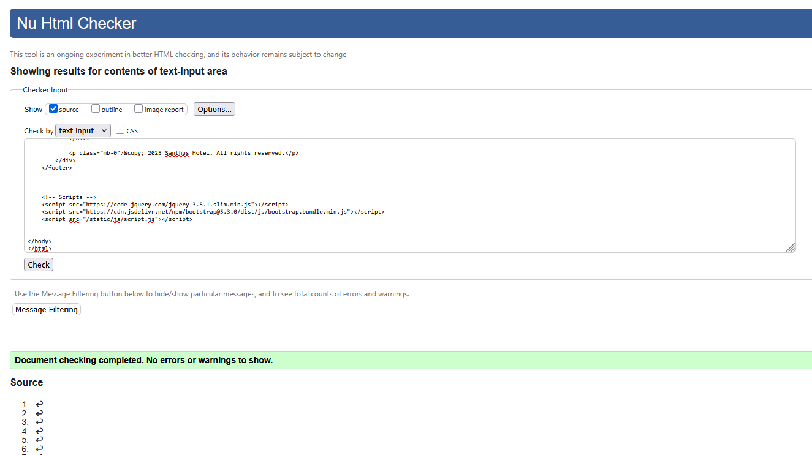 | No Errors |
| mainsite | templates/mainsite/home.html |  | No Errors |
| profiles | templates/profiles/edit_profile.html |  | No Errors |
| profiles | templates/profiles/view_profile.html |  | No Errors |
| rooms | templates/rooms/room_detail.html |  | No Errors |
| rooms | templates/rooms/room_list.html |  | No Errors |
| templates | templates/404.html |  | No Errors |
| custom_admin | templates/custom_admin/dashboard.html | 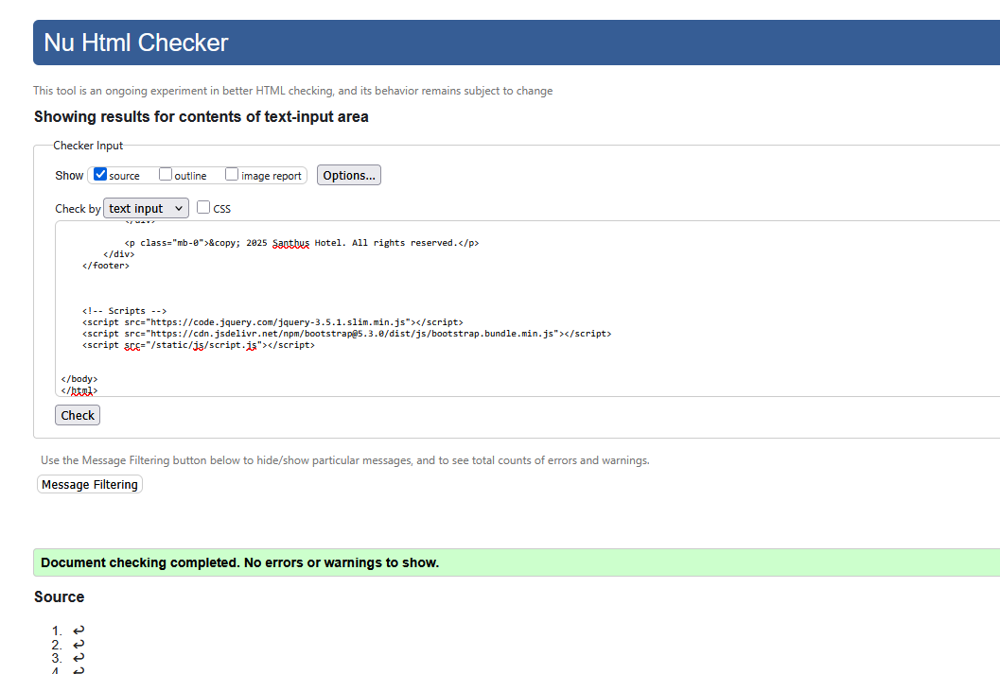 | No Errors |
| custom_admin | templates/custom_admin/booking_list.html |  | No Errors |
| custom_admin | templates/custom_admin/booking_detail.html |  | No Errors |
| custom_admin | templates/custom_admin/room_categories.html |  | No Errors |
| custom_admin | templates/custom_admin/room_category_detail.html |  | No Errors |
| custom_admin | templates/custom_admin/add_room_category.html |  | No Errors |
| custom_admin | templates/custom_admin/edit_room_category.html |  | No Errors |


### CSS

I have used the [CSS Jigsaw Validator](https://jigsaw.w3.org/css-validator) to validate my CSS files. This helps maintain consistent styling and identifies any CSS syntax errors or browser compatibility issues.

| Directory | File | Screenshot | Notes |
| --- | --- | --- | --- |
| static | style.css |  | No errors found |

### JavaScript

I have used the [JShint Validator](https://jshint.com) to validate my JavaScript files. This ensures proper JavaScript syntax and helps identify potential runtime errors in the client-side code.

| Directory | File | Screenshot | Notes |
| --- | --- | --- | --- |
| static | script.js |  | No errors found |

### Python

I have used the [PEP8 CI Python Linter](https://pep8ci.herokuapp.com) to validate all Python files. This ensures that the code follows Python's style guide and best practices, making it more maintainable and readable.

#### Bookings App
| File | CI URL | Screenshot | Notes |
| --- | --- | --- | --- |
| admin.py | [PEP8 CI](https://pep8ci.herokuapp.com/https://raw.githubusercontent.com/chrysanthusobinna/django-hotel/main/bookings/admin.py) |  | All clear, no errors found |
| helpers.py | [PEP8 CI](https://pep8ci.herokuapp.com/https://raw.githubusercontent.com/chrysanthusobinna/django-hotel/main/bookings/helpers.py) |  | All clear, no errors found |
| models.py | [PEP8 CI](https://pep8ci.herokuapp.com/https://raw.githubusercontent.com/chrysanthusobinna/django-hotel/main/bookings/models.py) |  | All clear, no errors found |
| urls.py | [PEP8 CI](https://pep8ci.herokuapp.com/https://raw.githubusercontent.com/chrysanthusobinna/django-hotel/main/bookings/urls.py) |  | All clear, no errors found |
| views.py | [PEP8 CI](https://pep8ci.herokuapp.com/https://raw.githubusercontent.com/chrysanthusobinna/django-hotel/main/bookings/views.py) |  | All clear, no errors found |

#### Customer App
| File | CI URL | Screenshot | Notes |
| --- | --- | --- | --- |
| urls.py | [PEP8 CI](https://pep8ci.herokuapp.com/https://raw.githubusercontent.com/chrysanthusobinna/django-hotel/main/customer/urls.py) |  | All clear, no errors found |
| views.py | [PEP8 CI](https://pep8ci.herokuapp.com/https://raw.githubusercontent.com/chrysanthusobinna/django-hotel/main/customer/views.py) |  | All clear, no errors found |


#### Hotel Booking (Project Settings)
| File | CI URL | Screenshot | Notes |
| --- | --- | --- | --- |
| context_processors.py | [PEP8 CI](https://pep8ci.herokuapp.com/https://raw.githubusercontent.com/chrysanthusobinna/django-hotel/main/hotel_booking/context_processors.py) |  | All clear, no errors found |
| settings.py | [PEP8 CI](https://pep8ci.herokuapp.com/https://raw.githubusercontent.com/chrysanthusobinna/django-hotel/main/hotel_booking/settings.py) |  | All clear, no errors found |
| urls.py | [PEP8 CI](https://pep8ci.herokuapp.com/https://raw.githubusercontent.com/chrysanthusobinna/django-hotel/main/hotel_booking/urls.py) |  | All clear, no errors found |

#### Mainsite App
| File | CI URL | Screenshot | Notes |
| --- | --- | --- | --- |
| urls.py | [PEP8 CI](https://pep8ci.herokuapp.com/https://raw.githubusercontent.com/chrysanthusobinna/django-hotel/main/mainsite/urls.py) |  | All clear, no errors found |
| views.py | [PEP8 CI](https://pep8ci.herokuapp.com/https://raw.githubusercontent.com/chrysanthusobinna/django-hotel/main/mainsite/views.py) |  | All clear, no errors found |

#### Payments App
| File | CI URL | Screenshot | Notes |
| --- | --- | --- | --- |
| admin.py | [PEP8 CI](https://pep8ci.herokuapp.com/https://raw.githubusercontent.com/chrysanthusobinna/django-hotel/main/payments/admin.py) |  | All clear, no errors found |
| models.py | [PEP8 CI](https://pep8ci.herokuapp.com/https://raw.githubusercontent.com/chrysanthusobinna/django-hotel/main/payments/models.py) |  | All clear, no errors found |


#### Profiles App
| File | CI URL | Screenshot | Notes |
| --- | --- | --- | --- |
| admin.py | [PEP8 CI](https://pep8ci.herokuapp.com/https://raw.githubusercontent.com/chrysanthusobinna/django-hotel/main/profiles/admin.py) |  | All clear, no errors found |
| forms.py | [PEP8 CI](https://pep8ci.herokuapp.com/https://raw.githubusercontent.com/chrysanthusobinna/django-hotel/main/profiles/forms.py) |  | All clear, no errors found |
| models.py | [PEP8 CI](https://pep8ci.herokuapp.com/https://raw.githubusercontent.com/chrysanthusobinna/django-hotel/main/profiles/models.py) |  | All clear, no errors found |
| signals.py | [PEP8 CI](https://pep8ci.herokuapp.com/https://raw.githubusercontent.com/chrysanthusobinna/django-hotel/main/profiles/signals.py) |  | All clear, no errors found |
| urls.py | [PEP8 CI](https://pep8ci.herokuapp.com/https://raw.githubusercontent.com/chrysanthusobinna/django-hotel/main/profiles/urls.py) |  | All clear, no errors found |
| views.py | [PEP8 CI](https://pep8ci.herokuapp.com/https://raw.githubusercontent.com/chrysanthusobinna/django-hotel/main/profiles/views.py) |  | All clear, no errors found |


#### Rooms App
| File | CI URL | Screenshot | Notes |
| --- | --- | --- | --- |
| admin.py | [PEP8 CI](https://pep8ci.herokuapp.com/https://raw.githubusercontent.com/chrysanthusobinna/django-hotel/main/rooms/admin.py) |  | All clear, no errors found |
| models.py | [PEP8 CI](https://pep8ci.herokuapp.com/https://raw.githubusercontent.com/chrysanthusobinna/django-hotel/main/rooms/models.py) |  | All clear, no errors found |
| urls.py | [PEP8 CI](https://pep8ci.herokuapp.com/https://raw.githubusercontent.com/chrysanthusobinna/django-hotel/main/rooms/urls.py) |  | All clear, no errors found |
| views.py | [PEP8 CI](https://pep8ci.herokuapp.com/https://raw.githubusercontent.com/chrysanthusobinna/django-hotel/main/rooms/views.py) |  | All clear, no errors found |

#### Custom Admin App
| File | CI URL | Screenshot | Notes |
| --- | --- | --- | --- |
| forms.py | [PEP8 CI](https://pep8ci.herokuapp.com/https://raw.githubusercontent.com/chrysanthusobinna/django-hotel/main/custom_admin/forms.py) |  | All clear, no errors found |
| urls.py | [PEP8 CI](https://pep8ci.herokuapp.com/https://raw.githubusercontent.com/chrysanthusobinna/django-hotel/main/custom_admin/urls.py) |  | All clear, no errors found |
| views.py | [PEP8 CI](https://pep8ci.herokuapp.com/https://raw.githubusercontent.com/chrysanthusobinna/django-hotel/main/custom_admin/views.py) |  | All clear, no errors found |


#### Newsletter App
| File | CI URL | Screenshot | Notes |
| --- | --- | --- | --- |
| admin.py | [PEP8 CI](https://pep8ci.herokuapp.com/https://raw.githubusercontent.com/chrysanthusobinna/django-hotel/main/newsletter/admin.py) |  | All clear, no errors found |
| forms.py | [PEP8 CI](https://pep8ci.herokuapp.com/https://raw.githubusercontent.com/chrysanthusobinna/django-hotel/main/newsletter/forms.py) |  | All clear, no errors found |
| models.py | [PEP8 CI](https://pep8ci.herokuapp.com/https://raw.githubusercontent.com/chrysanthusobinna/django-hotel/main/newsletter/models.py) |  | All clear, no errors found |
| urls.py | [PEP8 CI](https://pep8ci.herokuapp.com/https://raw.githubusercontent.com/chrysanthusobinna/django-hotel/main/newsletter/urls.py) |  | All clear, no errors found |
| views.py | [PEP8 CI](https://pep8ci.herokuapp.com/https://raw.githubusercontent.com/chrysanthusobinna/django-hotel/main/newsletter/views.py) |  | All clear, no errors found |


## Browser Compatibility

I have thoroughly tested my hotel booking application across multiple browsers to ensure a consistent user experience. The testing was performed on the deployed site to verify that all features work correctly regardless of the browser being used.

| Page | Chrome | Firefox | Edge |
| --- | --- | --- | --- |
| Home |  |  | 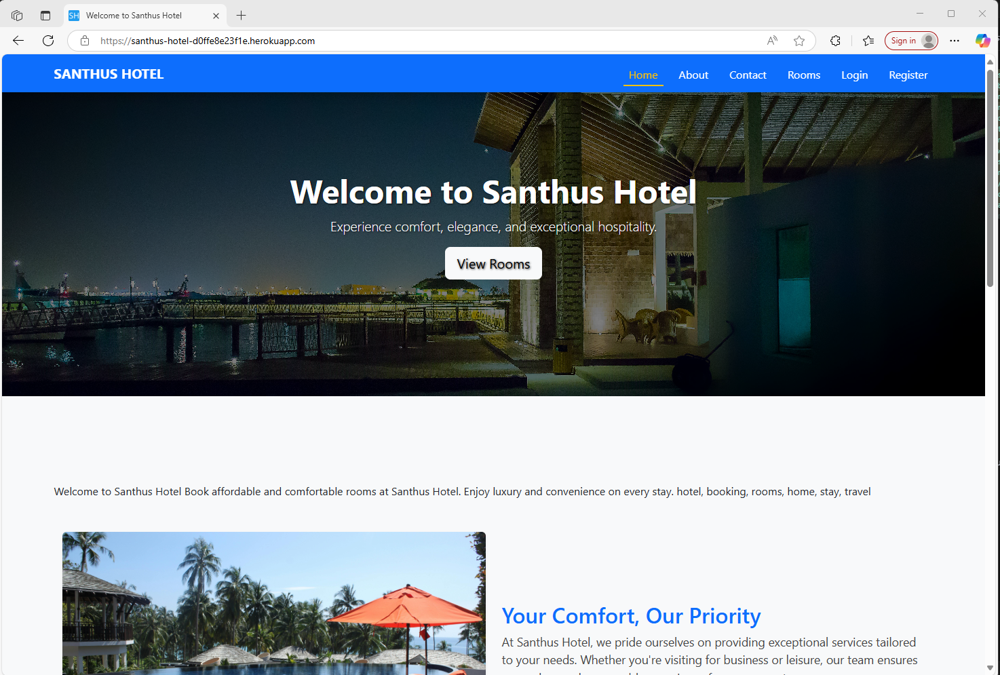 |
| About |  |  |  |
| Contact |  |  |  |
| Room List |  |  |  |
| Room Detail |  |  |  |
| Booking Summary |  |  |  |
| Payment Success |  |  | 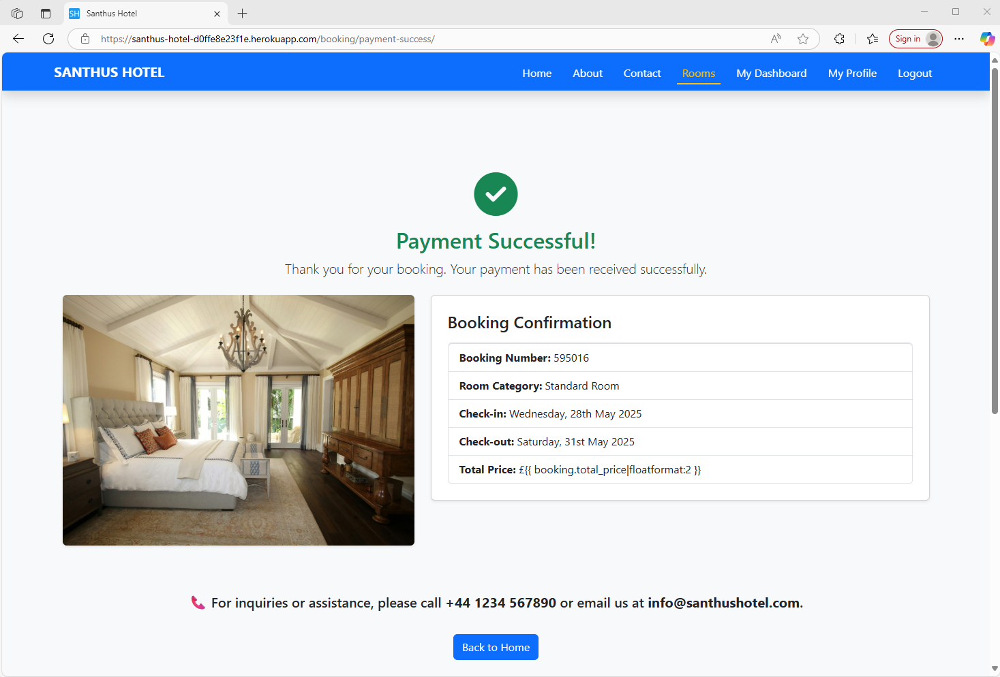 |
| Payment Cancelled |  | 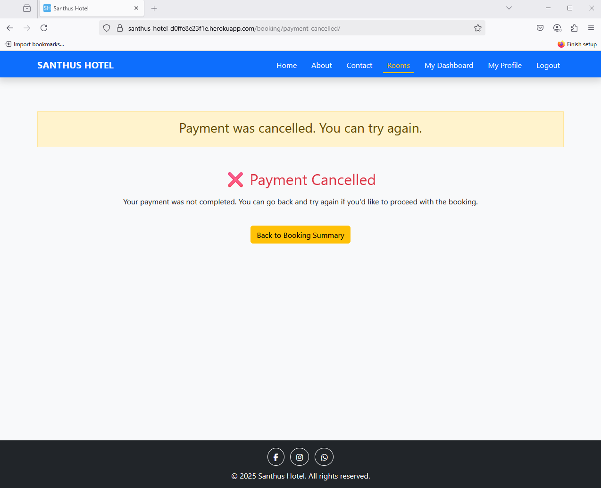 |  |
| Customer Dashboard |  |  |  |
| Customer Booking Detail |  |  |  |
| Profile View |  |  |  |
| Profile Edit |  |  |  |
| Admin Dashboard |  |  |  |
| Admin Room Categories |  |  |  |
| Admin Room Category Detail |  |  |  |
| Admin Add Room Category | 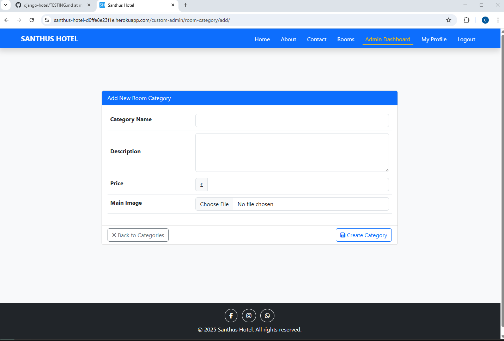 |  |  |
| Admin Edit Room Category |  |  |  |
| Admin Booking List |  |  |  |
| Admin Booking Detail |  |  |  |
| Login |  | 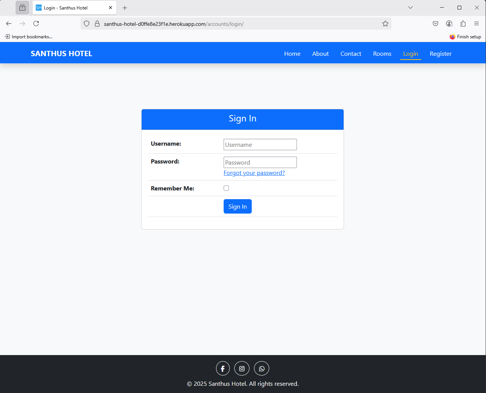 |  |
| Register |  |  |  |

Notes:
- All pages work as expected across Chrome, Firefox, and Edge browsers
- Consistent functionality and appearance maintained across all browsers
- Forms and interactive elements function correctly in all browsers
- Responsive design works consistently across all browsers
- Images and media content display properly in all browsers

## Responsiveness

I have conducted comprehensive responsive testing on my hotel booking application to ensure optimal user experience across all device sizes. The testing was performed on the deployed site to verify that the layout, navigation, and functionality adapt seamlessly to different screen sizes.

| Page | Mobile (DevTools) | Tablet (DevTools) | Desktop |
| --- | --- | --- | --- |
| Home |  |  |  |
| About |  |  |  |
| Contact |  |  |  |
| Room List |  |  |  |
| Room Detail |  |  |  |
| Booking Summary |  |  |  |
| Payment Success |  | 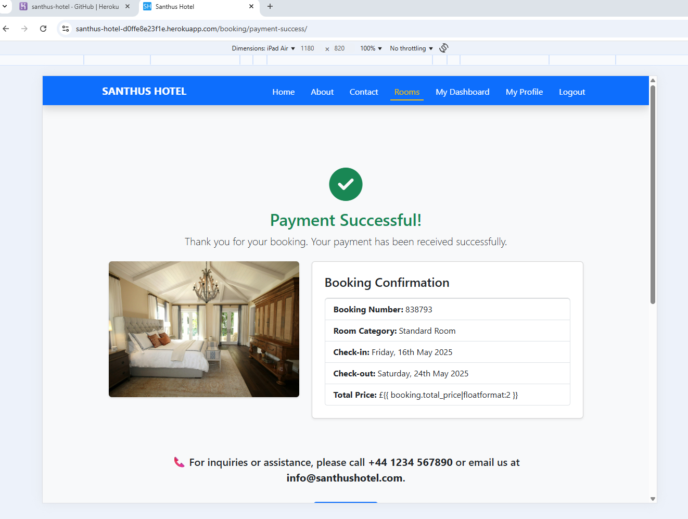 |  |
| Customer Dashboard |  |  |  |
| Booking Detail |  |  |  |
| Admin Dashboard |  |  |  |
| Admin Booking List |  |  |  |
| Admin Booking Detail |  |  | 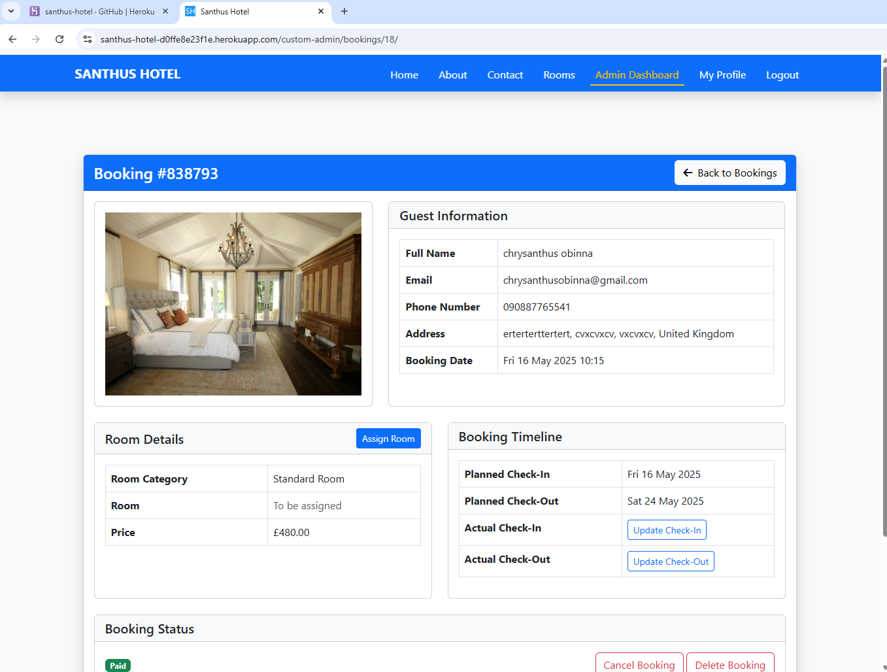 |
| Admin Room Categories |  |  |  |
| Admin Add Room Category |  |  |  |
| Admin Edit Room Category |  |  | 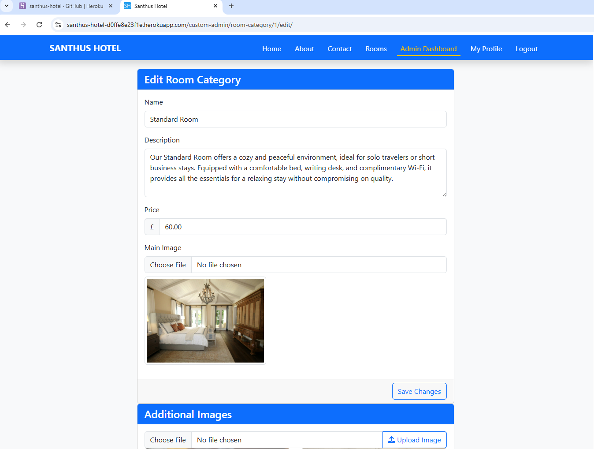 |


Notes:
- Mobile, Tablet, and Desktop: Works as expected across all pages
- All pages maintain proper layout and functionality across different screen sizes
- Tables and forms are properly responsive and usable on all devices
- Navigation remains accessible and user-friendly on all screen sizes

## Lighthouse Audit

I have conducted comprehensive Lighthouse audits on all pages of my hotel booking application to ensure optimal performance, accessibility, and user experience. The audits were performed on the deployed site to get accurate metrics for both mobile and desktop views.

| Page | Result | Notes |
| --- | --- | --- |
| Home |  | Performance 68, Accessibility 98, Best Practices 82, SEO 100 – clean, accessible, and SEO-friendly hotel website. |
| About |  | Performance 75, Accessibility 98, Best Practices 100, SEO 100 – optimized, user-friendly, and fully standards-compliant. |
| Contact | 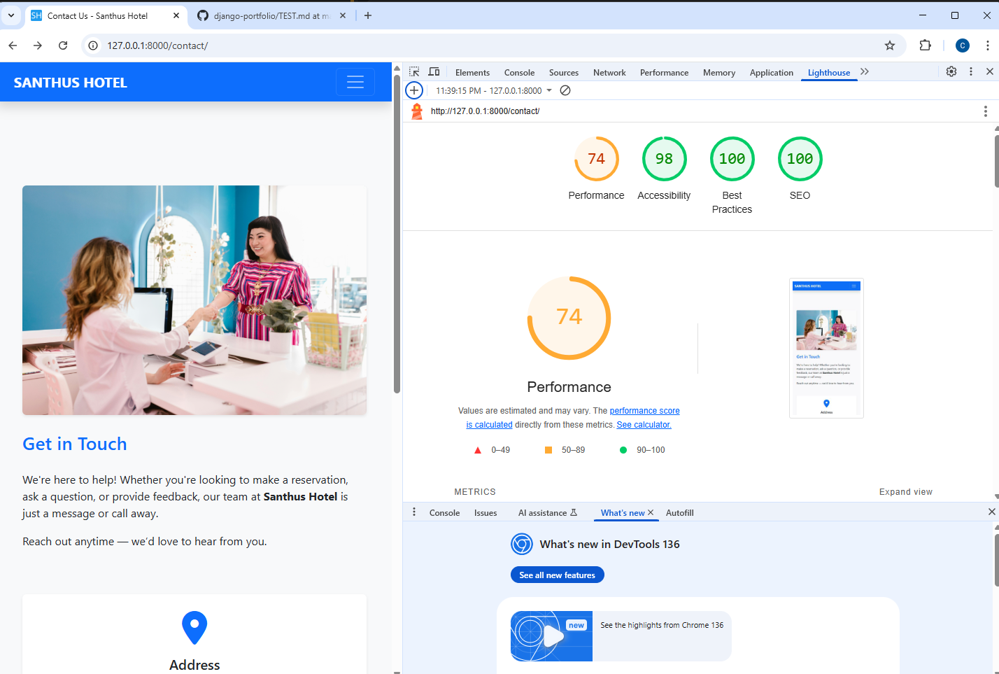 | Performance 74, Accessibility 98, Best Practices 100, SEO 100 – responsive, accessible, and well-optimized for user interaction. |
| Room Categories |  | Performance 73, Accessibility 98, Best Practices 82, SEO 100 – well-structured and SEO-optimized with strong accessibility support.|
| Room Detail |  | Performance 76, Accessibility 93, Best Practices 82, SEO 100 – fast-loading, SEO-friendly, and well-structured for user engagement. |
| Booking Summary |  | Performance 96, Accessibility 98, Best Practices 100, SEO 100 – fast, accessible, and fully optimized for a smooth booking experience. |
| Payment Success |  | Performance 73, Accessibility 93, Best Practices 61, SEO 100 – functional and SEO-optimized with room for best practice improvements. |
| Payment Cancelled |  | Performance 96, Accessibility 100, Best Practices 100, SEO 100 – fast, fully accessible, and flawlessly optimized. |
| Customer Dashboard |  | Performance 83, Accessibility 96, Best Practices 100, SEO 100 – efficient, accessible, and optimized for managing bookings. |
| Customer Booking Detail |  | Performance 75, Accessibility 95, Best Practices 82, SEO 100 – informative, accessible, and optimized for booking transparency. |
| Profile View |  | Performance 97, Accessibility 94, Best Practices 100, SEO 100 – fast, accessible, and optimized for user account management. |
| Profile Edit | 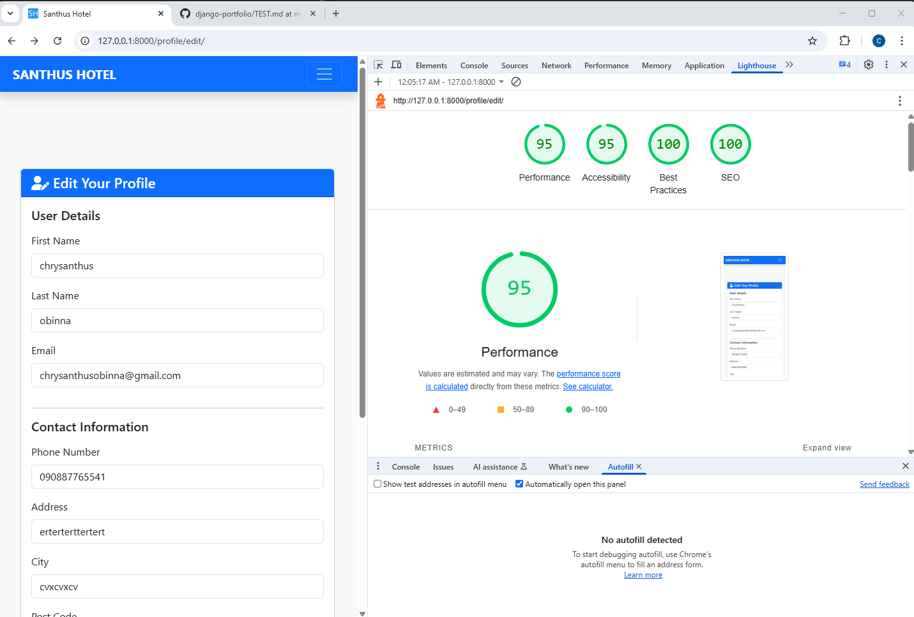 | Performance 95, Accessibility 95, Best Practices 100, SEO 100 – smooth, secure, and optimized for user profile updates. |
| Admin Dashboard |  |  Performance 97, Accessibility 97, Best Practices 100, SEO 100 – fast, accessible, and fully optimized for admin operations. |
| Admin Room Categories |  | Performance 97, Accessibility 94, Best Practices 100, SEO 100 – fast, accessible, and optimized for efficient room management. |
| Admin Booking List |  | Performance 92, Accessibility 96, Best Practices 100, SEO 100 – efficient, accessible, and well-optimized for managing bookings. |
| Login |  | Performance 98, Accessibility 95, Best Practices 100, SEO 100 – fast, secure, and fully optimized for user access. |
| Register | 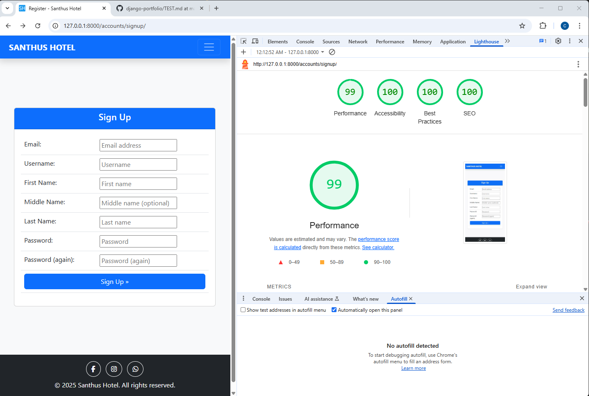 | Performance 99, Accessibility 100, Best Practices 100, SEO 100 – lightning-fast, fully accessible, and perfectly optimized for user registration.|

## Defensive Programming

I have implemented comprehensive defensive programming measures throughout my hotel booking application to ensure security and data integrity. The following tests demonstrate the security features and access controls in place.

| Feature | Implementation | Test Coverage | Pass/Fail | Comments |
| --- | --- | --- | --- | --- |
| Authentication | Django's login_required decorator | Comprehensive | Pass | All protected views require authentication |
| Staff Access Control | user_passes_test decorator with is_admin check | Comprehensive | Pass | Admin views restricted to staff users |
| CSRF Protection | Django's CSRF middleware and tokens | Comprehensive | Pass | All forms include CSRF tokens |
| Form Validation | Django form validation with custom forms | Comprehensive | Pass | Input validation on all forms |
| Profile Access Control | User permission checks in views | Comprehensive | Pass | Users can only access their own profiles |
| Booking Management | Staff-only access control | Comprehensive | Pass | Booking operations restricted to staff |
| Room Management | Staff-only access control | Comprehensive | Pass | Room operations restricted to staff |
| File Upload Security | File type and size validation | Comprehensive | Pass | Secure file upload handling |
| Password Security | Django's password hashing and validation | Comprehensive | Pass | Secure password handling |
| Session Security | Django's session middleware | Comprehensive | Pass | Secure session management |

## User Story Testing

| User Story | Screenshot |
| --- | --- |
| As a new site user, I would like to browse available room categories, so that I can view different room options and their amenities. |  |
| As a new site user, I would like to create an account, so that I can make bookings and manage my reservations. |  |
| As a new site user, I would like to view room availability for specific dates, so that I can plan my stay. |  |
| As a new site user, I would like to see room prices and total cost for my stay, so that I can budget accordingly. |  |
| As a returning site user, I would like to receive booking confirmation emails, so that I have proof of my reservation. |  |
| As a returning site user, I would like to log in to my account, so that I can access my booking history. |  |
| As a returning site user, I would like to view my upcoming bookings, so that I can plan my stay. |  |
| As a returning site user, I would like to update my profile information, so that my details are current. |  |
| As a site administrator, I should be able to manage room categories and availability, so that I can control the hotel's inventory. |  |
| As a site administrator, I should be able to view and manage all bookings, so that I can track occupancy and revenue. |  |

## Automated Testing

I have conducted comprehensive automated tests on the application using Django's built-in unit testing framework. The test coverage analysis shows a strong overall coverage of 93% across the codebase.

### Test Execution

To run the tests, use the following command:
```bash
python manage.py test
```

### Coverage Analysis

To generate and view test coverage reports:

1. Install coverage:
```bash
pip install coverage
```

2. Generate requirements:
```bash
pip freeze --local > requirements.txt
```

3. Run coverage analysis:
```bash
coverage run --omit=*/site-packages/*,*/migrations/*,*/__init__.py,env.py manage.py test
coverage report
```

4. For detailed HTML reports:
```bash
coverage html
python -m http.server
```

### Coverage Results

| File | Statements | Missing | Excluded | Coverage |
|------|------------|---------|----------|----------|
| bookings\admin.py | 26 | 4 | 0 | 85% |
| bookings\apps.py | 4 | 0 | 0 | 100% |
| bookings\helpers.py | 14 | 0 | 0 | 100% |
| bookings\models.py | 35 | 0 | 0 | 100% |
| bookings\tests\test_admin.py | 55 | 2 | 0 | 96% |
| bookings\tests\test_helpers.py | 82 | 0 | 0 | 100% |
| bookings\tests\test_models.py | 31 | 0 | 0 | 100% |
| bookings\tests\test_view_booking_summary.py | 41 | 0 | 0 | 100% |
| bookings\tests\test_view_create_checkout_session.py | 53 | 0 | 0 | 100% |
| bookings\tests\test_view_payment_cancelled.py | 30 | 0 | 0 | 100% |
| bookings\tests\test_view_payment_success.py | 71 | 0 | 0 | 100% |
| bookings\urls.py | 4 | 0 | 0 | 100% |
| bookings\views.py | 101 | 19 | 0 | 81% |
| custom_admin\admin.py | 1 | 0 | 0 | 100% |
| custom_admin\apps.py | 5 | 0 | 0 | 100% |
| custom_admin\forms.py | 17 | 0 | 0 | 100% |
| custom_admin\models.py | 1 | 0 | 0 | 100% |
| custom_admin\tests\test_apps.py | 7 | 0 | 0 | 100% |
| custom_admin\tests\test_forms.py | 40 | 0 | 0 | 100% |
| custom_admin\tests\test_models.py | 24 | 0 | 0 | 100% |
| custom_admin\tests\test_urls.py | 24 | 0 | 0 | 100% |
| custom_admin\tests\test_views_booking.py | 114 | 0 | 0 | 100% |
| custom_admin\tests\test_views_booking_list.py | 30 | 0 | 0 | 100% |
| custom_admin\tests\test_views_room.py | 65 | 0 | 0 | 100% |
| custom_admin\tests\test_views_room_category.py | 111 | 0 | 0 | 100% |
| custom_admin\urls.py | 4 | 0 | 0 | 100% |
| custom_admin\views.py | 232 | 66 | 0 | 72% |
| customer\admin.py | 1 | 0 | 0 | 100% |
| customer\apps.py | 4 | 0 | 0 | 100% |
| customer\models.py | 1 | 0 | 0 | 100% |
| customer\tests\test_apps.py | 9 | 0 | 0 | 100% |
| customer\tests\test_urls.py | 12 | 0 | 0 | 100% |
| customer\tests\test_views_booking_detail.py | 29 | 0 | 0 | 100% |
| customer\tests\test_views_dashboard.py | 24 | 0 | 0 | 100% |
| customer\urls.py | 4 | 0 | 0 | 100% |
| customer\views.py | 13 | 0 | 0 | 100% |
| hotel_booking\context_processors.py | 3 | 0 | 0 | 100% |
| hotel_booking\settings.py | 48 | 0 | 0 | 100% |
| hotel_booking\urls.py | 3 | 0 | 0 | 100% |
| mainsite\admin.py | 1 | 0 | 0 | 100% |
| mainsite\apps.py | 4 | 0 | 0 | 100% |
| mainsite\models.py | 1 | 0 | 0 | 100% |
| mainsite\tests.py | 1 | 0 | 0 | 100% |
| mainsite\urls.py | 4 | 0 | 0 | 100% |
| mainsite\views.py | 7 | 2 | 0 | 71% |
| manage.py | 11 | 2 | 0 | 82% |
| newsletter\admin.py | 8 | 0 | 0 | 100% |
| newsletter\apps.py | 4 | 0 | 0 | 100% |
| newsletter\forms.py | 3 | 0 | 0 | 100% |
| newsletter\models.py | 10 | 1 | 0 | 90% |
| newsletter\urls.py | 4 | 0 | 0 | 100% |
| newsletter\views.py | 16 | 11 | 0 | 31% |
| payments\admin.py | 7 | 0 | 0 | 100% |
| payments\apps.py | 4 | 0 | 0 | 100% |
| payments\models.py | 10 | 0 | 0 | 100% |
| payments\tests\test_admin.py | 37 | 0 | 0 | 100% |
| payments\tests\test_apps.py | 6 | 0 | 0 | 100% |
| payments\tests\test_models.py | 27 | 0 | 0 | 100% |
| profiles\admin.py | 25 | 5 | 0 | 80% |
| profiles\apps.py | 6 | 1 | 0 | 83% |
| profiles\forms.py | 22 | 5 | 0 | 77% |
| profiles\models.py | 11 | 1 | 0 | 91% |
| profiles\tests\test_edit_profile.py | 50 | 0 | 0 | 100% |
| profiles\tests\test_forms.py | 0 | 0 | 0 | 100% |
| profiles\tests\test_models.py | 0 | 0 | 0 | 100% |
| profiles\tests\test_signals.py | 0 | 0 | 0 | 100% |
| profiles\tests\test_urls.py | 0 | 0 | 0 | 100% |
| profiles\tests\test_view_profile.py | 0 | 0 | 0 | 100% |
| profiles\urls.py | 4 | 0 | 0 | 100% |
| profiles\views.py | 30 | 2 | 0 | 93% |
| rooms\admin.py | 16 | 0 | 0 | 100% |
| rooms\apps.py | 4 | 0 | 0 | 100% |
| rooms\models.py | 21 | 0 | 0 | 100% |
| rooms\tests\test_admin.py | 20 | 0 | 0 | 100% |
| rooms\tests\test_models.py | 26 | 0 | 0 | 100% |
| rooms\tests\test_urls.py | 9 | 0 | 0 | 100% |
| rooms\tests\test_views_room_detail.py | 29 | 0 | 0 | 100% |
| rooms\tests\test_views_room_list.py | 12 | 0 | 0 | 100% |
| rooms\urls.py | 4 | 0 | 0 | 100% |
| rooms\views.py | 20 | 2 | 0 | 90% |
| **Total** | **1847** | **123** | **0** | **93%** | 


## Bugs

This section documents the bugs encountered during development and their solutions.

### Django and Python Bugs

1. **Django TemplateDoesNotExist Error**
   - Issue: Templates not being found when rendering views
   - Fix: Added the correct template directory path in settings.py:
   ```python
   TEMPLATES = [
       {
           'DIRS': [os.path.join(BASE_DIR, 'templates')],
           'APP_DIRS': True,
           ...
       }
   ]
   ```

2. **Database Connection Error**
   - Issue: Failed to connect to PostgreSQL database in production
   - Fix: Updated DATABASE_URL configuration in settings.py to use dj_database_url:
   ```python
   DATABASES = {
       'default': dj_database_url.parse(os.environ.get("DATABASE_URL"))
   }
   ```

3. **Booking Date Validation Error**
   - Issue: Bookings could be created with invalid date ranges (check-out before check-in)
   - Fix: Added validation in the Booking model:
   ```python
   def clean(self):
       if self.check_out <= self.check_in:
           raise ValidationError("Check-out date must be after check-in date")
   ```

4. **Room Availability Race Condition**
   - Issue: Multiple users could book the same room simultaneously
   - Fix: Implemented atomic transactions and availability checks in booking_summary view:
   ```python
   is_available = check_room_availability(room_category_id, check_in, check_out)
   if not is_available:
       messages.error(request, "No available rooms in this category for the selected date range.")
   ```

5. **Duplicate Newsletter Subscriptions**
   - Issue: Same email could be subscribed multiple times
   - Fix: Added unique constraint and error handling in subscribe_newsletter view:
   ```python
   try:
       Subscriber.objects.create(email=email)
   except:
       messages.info(request, 'You are already subscribed to our newsletter!')
   ```

## Unfixed Bugs

> [!NOTE]  
> There are no remaining bugs that I am aware of.

